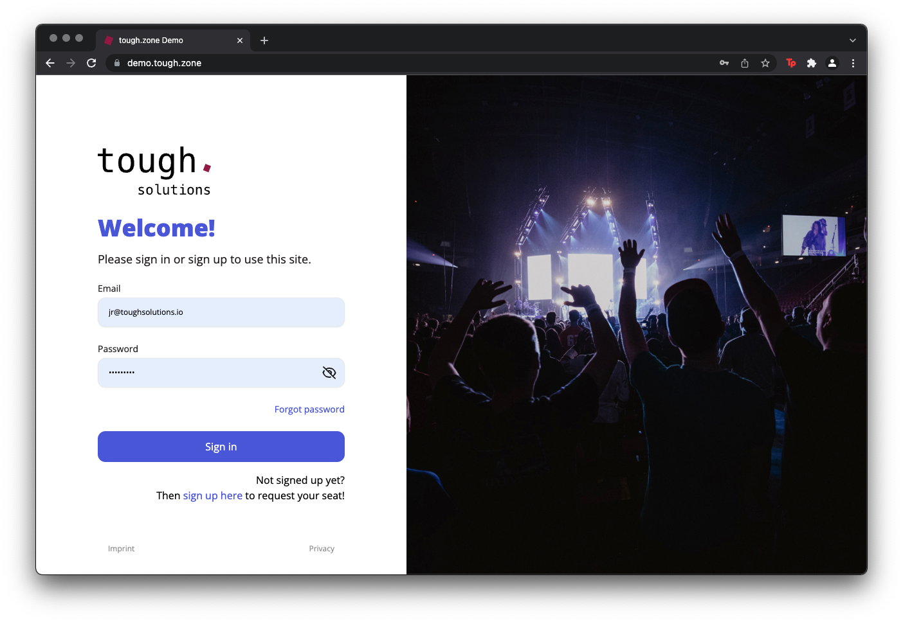
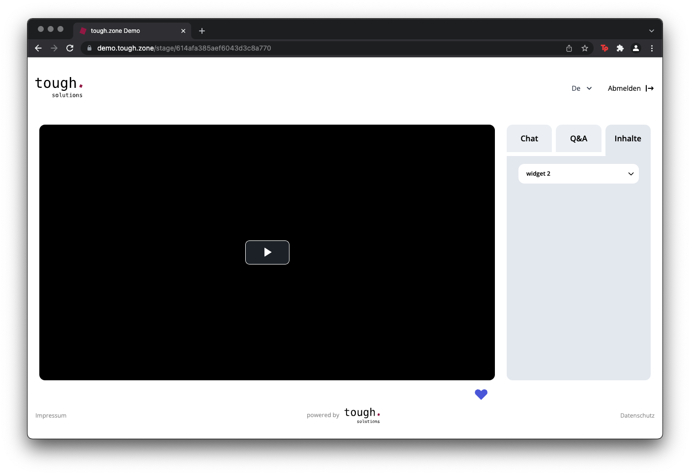

# Client logo

The exchangeable client logo is visible in two ways:

1. on the [cover page](CoverPage.md)
2. on the header of every page after sign in

## Specifications

* SVG (and PNG if used in [email templates](CustomEmails.md))
* no padding around logo (this is added with HTML on the page)

## Examples

