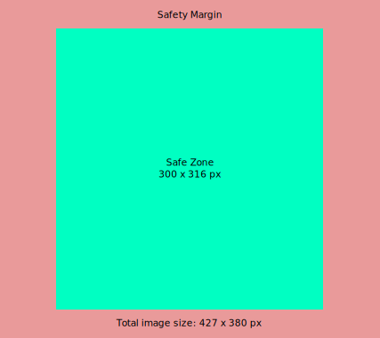

# Stage Tiles

When using more than one stage, users will see an overview of available stages after logging in. To
provide a fresher look, stages are arranged in tiles which include an image. We provide default
images that are nice to look at and very neutral but of course this provides an opportunity to
further adjust the look and feel of your <ToughZone /> instance.

## Main Stage tile

::: warning
🚧 This section is work in progress.
:::

## Regular Stage tile

When choosing an image for regular stages, we have to have in mind that because of the responsive
nature of <ToughZone />, our images are displayed in various sizes depending on the width of the
user's viewport.

On large viewports, the image's maximum size starts with **286 x 316 px**. When the viewport's width
shrinks, the image's left and right sides are trimmed down to a minimum of **214 px** width. The
height is fixed until here.

On narrower viewports, stage tiles are stacked, therefore their sizes are stepped up to

* first **342 x 316 px** and
* then to **427 x 380 px**.

The latter one represents the smallest viewport, therefore with shrinking width, image sides are
trimmed again.

Trimming therefore leads to a safety margin that needs to be respected when designing images for
stage tiles. The width of this safety margin depends on the narrowest viewport you want to target,
we generally recommend this to be **375 px** which is the screen width of an Apple iPhone SE first
gen.

### Hard facts

* Total image size: **427 x 380 px**
* Safety margin left and right: **63.5 px**
* Safety margin top and bottom: **32 px**
* Image formats:
    * `jpg`
    * `png`
    * `svg` (preferred)
